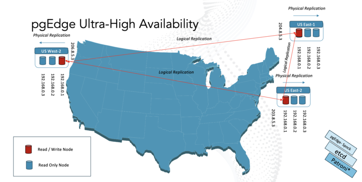

# pgedge-patroni: pgEdge's Ultra-HA Clustering Solution

Welcome to **pgedge-patroni**, a sophisticated adaptation of Patroni tailored explicitly for pgEdge's Ultra-HA Clustering environment.

## Overview

**pgedge-patroni** leverages Patroni, a Python-based template for building highly available (HA) solutions with PostgreSQL. It streamlines the deployment and management of PostgreSQL clusters, ensuring unwavering reliability and resilience.

## Key Features

- Seamless integration with pgEdge's multimaster platform.
- Fine-tuned adjustments to ensure optimal performance in an Ultra-HA environment.
- Enhanced failover mechanisms for uninterrupted service availability.
- Compatibility with PostgreSQL versions 15, 16, and beyond.

## PgEdge Enhancements

pgEdge's modifications to Patroni include:

- Customized configurations to support pgEdge's multimaster architecture.
- Dynamic adjustments to PostgreSQL parameters for improved compatibility.
- Advanced fault tolerance mechanisms to handle primary and standby failures gracefully.

## How Patroni Works

Patroni intelligently manages PostgreSQL instances by orchestrating replication and failover processes. It employs leader election algorithms and consensus mechanisms to maintain cluster stability and data integrity.

## Contribution Guidelines

We encourage contributions to **pgedge-patroni**. Please refer to our [Contribution Guidelines](CONTRIBUTING.md) for details on how to get involved.

## License

**pgedge-patroni** is licensed under the [MIT License](LICENSE). See the LICENSE file for full details.

Let's collaborate to build robust, scalable, and high-performance PostgreSQL clusters with pgEdge's Ultra-HA Clustering Solution.
